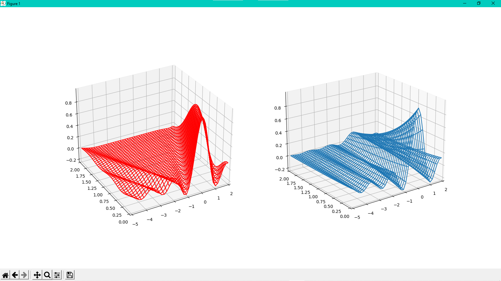
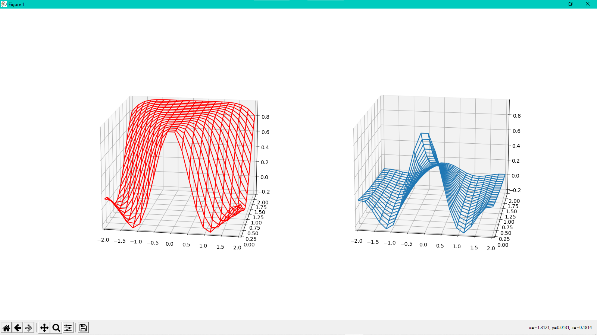
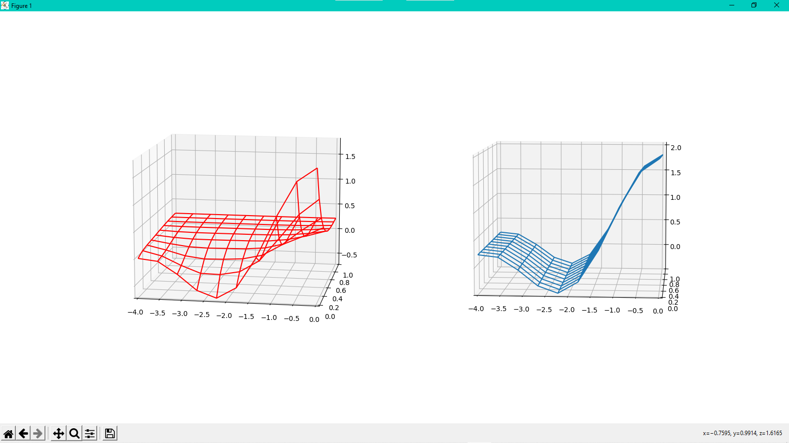

raisedCosine
============

Take a look how beautiful raised cosine is 😍



**Red** - using implemented function value distribution

**Blue** - using exponent of time or `exp(-tt)` in project code

Initially the idea of project was to just plot the cardinal sine function.

But then I watched the [Solving the heat equation | DE3](https://youtu.be/ToIXSwZ1pJU) video from **3Blue1Brown** channel
and this inspired me to plot the graph of function value distribution through time.

This algorithm works fine for _non-symmetrical_ ranges, but for _symmetrical_ one it's just distributing straight
to the median value (because median in scope of this implemetation is the **fixed point**).



**Update**: After normalizing the function values, the algorithm works fine both for symmetrical and non-symmetrical ranges
(in math **even** and **odd** functions).

Also added angular velocity squared to the exponent term: `zb = funb * exp(-alpha * ((2 * pi * domain_freq) ** 2) * y) + avg`




As you can see, resulting distribution fits in a shorter time, than a simple exponent distribution.

How to use
==========

1. Ensure you have **Python 3.9** version and installed **pipenv**.
2. Set the `PIPENV_VENV_IN_PROJECT` variable to `1` in your terminal:
   - if you are on UNIX-like system:

       ```
       export PIPENV_VENV_IN_PROJECT=1
        ```
   - if you are on Windows:
       - on PowerShell: 
        
           ```
             $PIPENV_VENV_IN_PROJECT = 1
         ```
         
       - on CMD: 
       
           ```
           set PIPENV_VENV_IN_PROJECT=1
           ```
         
3. Clone the repository and proceed to project root dir:
    ```
    git clone https://github.com/dkostmii/raisedCosine.git
    cd ./raisedCosine
    ```
4. Enter to the environment of project: 
    ```
    pipenv shell
    ```
5. Install dependencies:
    ```
    pipenv install
    ```
6. If you want to, you can open the project in **PyCharm** and run it.
    
    \
    Otherwise you run project by:
    ```
    python main.py
    ```
